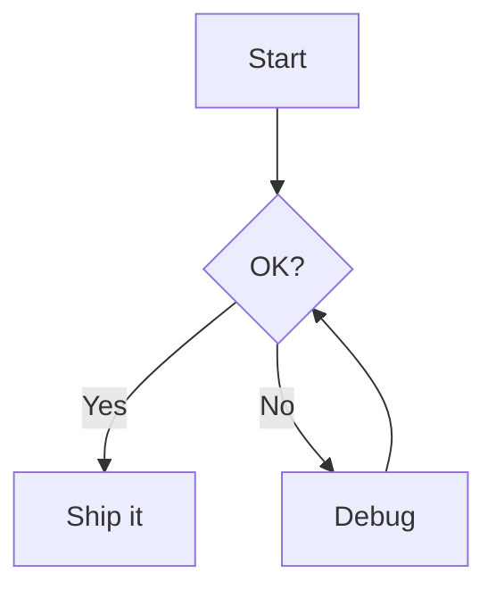

<!-- _class: lead -->
<!-- _paginate: false -->
<!-- _header: '' -->
<!-- _footer: '' -->


# Bokuchi Editor

### A free, offline Markdown editor
### for Windows, macOS, and Linux

---

## What is Bokuchi?

- A **Markdown editor** that runs entirely on your machine
- **No cloud**, no account, no tracking — your files stay local
- **Real-time preview** while you type
- **Cross-platform**: Windows · macOS · Linux
- **Open source** and free to use

> This very slide deck is written in Markdown and rendered by Bokuchi's Marp feature.

---

## Why Bokuchi?

| | |
|---|---|
| **Offline first** | Works without an internet connection |
| **Real-time preview** | See the rendered result as you type |
| **Multi-tab editing** | Open many files, session auto-restored |
| **Rich features** | Variables, KaTeX, Mermaid, Marp, and more |
| **14 UI languages** | English, 日本語, 中文, Español, हिन्दी, … |

---

## Editor & Preview, Side by Side


- **Split view** — edit on the left, preview on the right
- **Editor only** / **Preview only** modes available
- Scrolling stays **synchronized**
- Switch modes anytime with `Ctrl+Shift+1/2/3`

---

## UI at a Glance


- **Tab bar** for open files
- **Folder tree** for navigation
- **Outline** panel for headings
- **Status bar** with zoom & stats
- **Preview** pane on the right

---

## Multi-Tab Editing


- Open **many files** at once
- **Drag & drop** to reorder
- **Session restore** — pick up where you left off
- `Ctrl+Tab` / `Ctrl+Shift+Tab` to switch
- Horizontal **or** vertical tabs

---

## Folder Tree


- Browse any folder as a **workspace**
- Create, rename, delete files in place
- Works great for **docs repositories** and **note systems**
- Stays in sync with the editor

---

## Outline Panel


- Shows all **headings** in the document
- Click to **jump** to a section
- Essential for **long documents**, specs, and minutes
- Updates live as you edit

---

## Markdown Toolbar


- One-click **bold**, *italic*, headings, lists
- **Table**, **code block**, **link**, **image**
- **Table conversion** from TSV / CSV
- No need to remember every Markdown symbol

---

## Variables — Reusable Placeholders


```markdown
<!-- @var projectName: Bokuchi -->
<!-- @var version: 1.0.0 -->

# {{projectName}} Docs

Version: {{version}}
```

- **Local** variables: declared in the document
- **Global** variables: shared across all documents
- Local takes precedence over global

---

## KaTeX — Beautiful Math


Inline: $E = mc^2$

Block:

$$
\int_{-\infty}^{\infty} e^{-x^2}\,dx = \sqrt{\pi}
$$

- Full **LaTeX** equation support
- Rendered **instantly** in the preview

---

## Mermaid — Diagrams from Text


````markdown

````

- **Flowcharts**, **sequence**, **class**, **gantt**, and more
- Diagrams stay in **version control** as plain text

---

## Marp — Slides from Markdown

You are looking at one right now.

```markdown
---
marp: true
---

# Slide 1

Hello!

---

# Slide 2

- Bullet A
- Bullet B
```

- Enable in **Settings → Advanced → Rendering Extensions**
- Navigate with **arrow keys** in Preview-only mode
- Fullscreen & thumbnail grid built in

---

## Themes


- **5 built-in themes** — Default, Dark, Darcula, Pastel, Vivid
- Separate themes for **editor** and **preview**
- Custom **CSS** supported

---

## Search & Replace


- Search within the current file
- **Cross-tab search** across all open files
- **Regex** and case-sensitive options
- Replace one match, or replace all

---

## Keyboard Shortcuts (a few essentials)

| Action | Windows / Linux | macOS |
|--------|-----------------|-------|
| New file | `Ctrl+N` | `Cmd+N` |
| Open file | `Ctrl+O` | `Cmd+O` |
| Save | `Ctrl+S` | `Cmd+S` |
| Next tab | `Ctrl+Tab` | `Ctrl+Tab` |
| Zoom in / out | `Ctrl++` / `Ctrl+-` | `Cmd++` / `Cmd+-` |
| Settings | `Ctrl+,` | `Cmd+,` |

---

## Get Bokuchi

- **Web Site**: https://bokuchi.com/
- **Download**: https://github.com/Bokuchi-Editor/bokuchi/releases
- **Docs**: https://doc.bokuchi.com
- **Source**: https://github.com/Bokuchi-Editor/bokuchi

Free and open source.
No account. No cloud. No tracking.

---

<!-- _class: lead -->
<!-- _paginate: false -->
<!-- _header: '' -->
<!-- _footer: '' -->

# Thank you!

### Happy writing with Bokuchi ✍️


