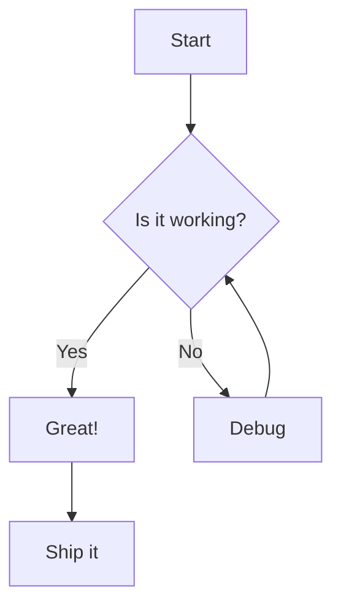
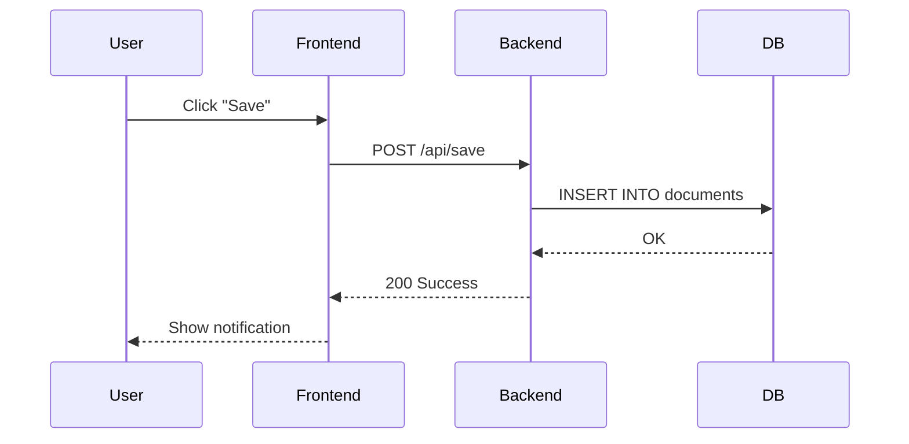
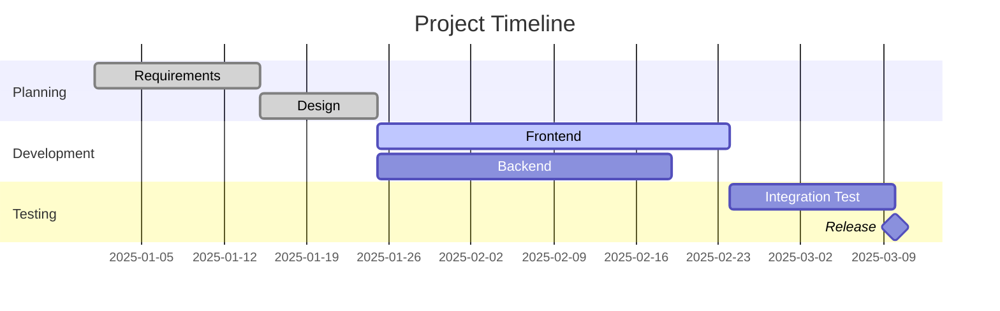
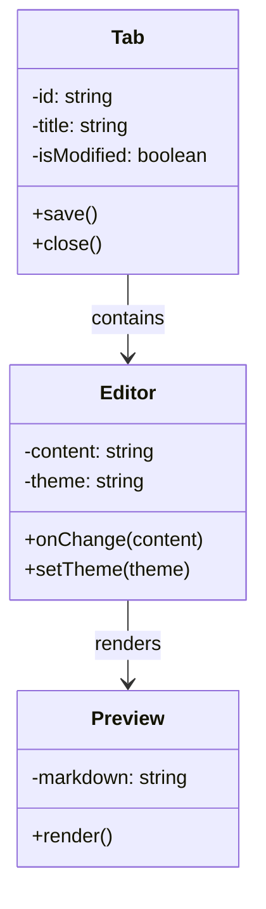
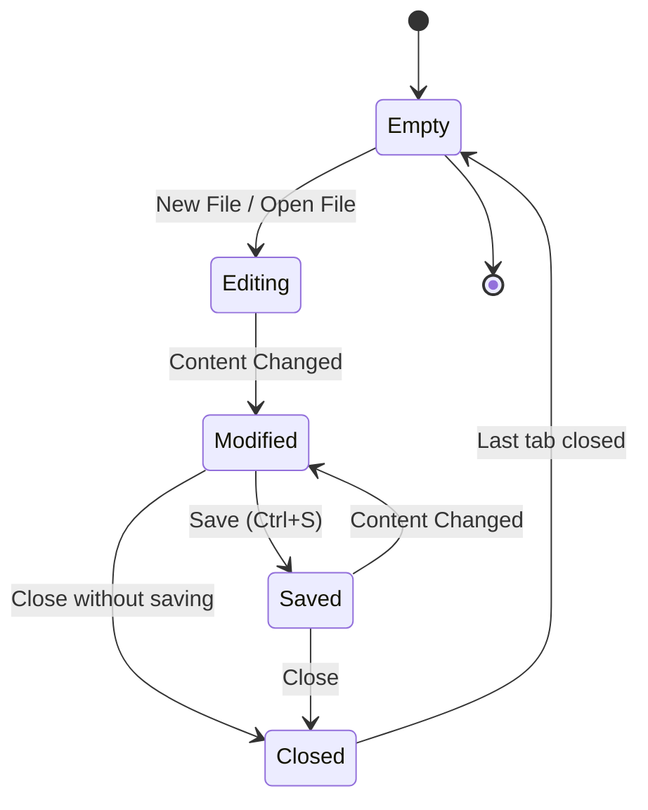
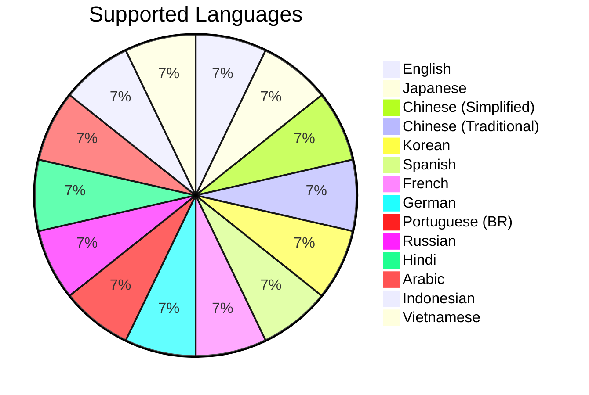

# Mermaid Diagram Samples

A collection of Mermaid diagrams to verify rendering in Bokuchi.

## Flowchart



## Sequence Diagram



## Gantt Chart



## Class Diagram



## State Diagram



## Pie Chart



## Error Handling Test

The following block contains intentional syntax errors to verify error display:

```mermaid
invalid diagram syntax !!!
this should show an error message
```
