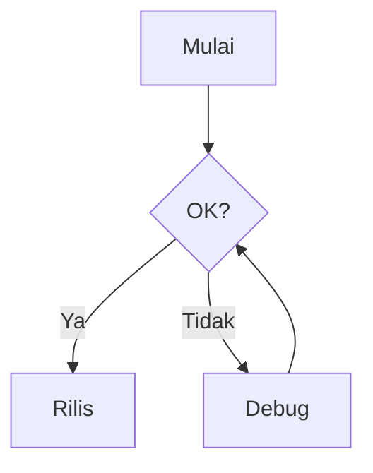

<!-- _class: lead -->
<!-- _paginate: false -->
<!-- _header: '' -->
<!-- _footer: '' -->


# Bokuchi Editor

### Editor Markdown offline yang gratis
### untuk Windows, macOS, dan Linux

---

## Apa itu Bokuchi?

- Sebuah **editor Markdown** yang berjalan sepenuhnya di komputer Anda
- **Tanpa cloud**, tanpa akun, tanpa pelacakan — file Anda tetap di lokal
- **Pratinjau real-time** saat Anda mengetik
- **Lintas platform**: Windows · macOS · Linux
- **Open source** dan gratis digunakan

> Slide deck ini ditulis dalam Markdown dan dirender oleh fitur Marp Bokuchi.

---

## Mengapa Bokuchi?

| | |
|---|---|
| **Offline-first** | Berfungsi tanpa koneksi internet |
| **Pratinjau real-time** | Lihat hasil render saat mengetik |
| **Pengeditan multi-tab** | Buka banyak file, sesi dipulihkan otomatis |
| **Fitur lengkap** | Variabel, KaTeX, Mermaid, Marp, dan lainnya |
| **14 bahasa UI** | English, 日本語, 中文, Español, हिन्दी, … |

---

## Editor & Pratinjau Berdampingan


- **Tampilan terbagi** — edit di kiri, pratinjau di kanan
- Mode **hanya editor** / **hanya pratinjau** juga tersedia
- Scroll tetap **tersinkronisasi**
- Ganti mode kapan saja dengan `Ctrl+Shift+1/2/3`

---

## Sekilas Antarmuka


- **Bilah tab** untuk file yang dibuka
- **Pohon folder** untuk navigasi
- Panel **outline** untuk daftar heading
- **Bilah status** dengan zoom & statistik
- Panel **pratinjau** di sebelah kanan

---

## Pengeditan Multi-Tab


- Buka **banyak file** sekaligus
- **Drag & drop** untuk mengatur urutan
- **Pemulihan sesi** — lanjutkan dari tempat terakhir
- `Ctrl+Tab` / `Ctrl+Shift+Tab` untuk berpindah
- Tab **horizontal atau vertikal**

---

## Pohon Folder


- Jelajahi folder mana saja sebagai **ruang kerja**
- Buat, ubah nama, hapus file langsung di tempat
- Cocok untuk **repositori dokumen** dan sistem catatan
- Selalu tersinkron dengan editor

---

## Panel Outline


- Menampilkan semua **heading** di dokumen
- Klik untuk **melompat** ke bagian tertentu
- Penting untuk **dokumen panjang**, spesifikasi, dan notulen
- Diperbarui secara langsung saat Anda mengedit

---

## Toolbar Markdown


- Satu klik untuk **tebal**, *miring*, heading, daftar
- **Tabel**, **blok kode**, **tautan**, **gambar**
- **Konversi tabel** dari TSV / CSV
- Tak perlu mengingat setiap simbol Markdown

---

## Variabel — Placeholder yang Dapat Digunakan Ulang


```markdown
<!-- @var projectName: Bokuchi -->
<!-- @var version: 1.0.0 -->

# Dokumentasi {{projectName}}

Versi: {{version}}
```

- Variabel **lokal**: dideklarasikan di dalam dokumen
- Variabel **global**: dibagikan ke semua dokumen
- Lokal lebih diutamakan daripada global

---

## KaTeX — Matematika yang Elegan


Inline: $E = mc^2$

Blok:

$$
\int_{-\infty}^{\infty} e^{-x^2}\,dx = \sqrt{\pi}
$$

- Dukungan penuh persamaan **LaTeX**
- Dirender **seketika** di pratinjau

---

## Mermaid — Diagram dari Teks


````markdown

````

- **Flowchart**, **sequence**, **class**, **gantt**, dan lainnya
- Diagram tetap berada di **version control** sebagai teks biasa

---

## Marp — Slide dari Markdown

Anda sedang melihat salah satunya sekarang.

```markdown
---
marp: true
---

# Slide 1

Halo!

---

# Slide 2

- Poin A
- Poin B
```

- Aktifkan di **Pengaturan → Lanjutan → Rendering Extensions**
- Gunakan **tombol panah** di mode Pratinjau saja
- Fullscreen & thumbnail grid sudah tersedia

---

## Tema


- **5 tema bawaan** — Default, Dark, Darcula, Pastel, Vivid
- Tema terpisah untuk **editor** dan **pratinjau**
- Mendukung **CSS** kustom

---

## Pencarian & Penggantian


- Mencari dalam file saat ini
- **Pencarian lintas tab** di semua file yang dibuka
- Opsi **regex** dan sensitif huruf besar/kecil
- Ganti satu per satu, atau ganti semua

---

## Pintasan Keyboard (beberapa yang penting)

| Aksi | Windows / Linux | macOS |
|--------|-----------------|-------|
| File baru | `Ctrl+N` | `Cmd+N` |
| Buka file | `Ctrl+O` | `Cmd+O` |
| Simpan | `Ctrl+S` | `Cmd+S` |
| Tab berikutnya | `Ctrl+Tab` | `Ctrl+Tab` |
| Perbesar / Perkecil | `Ctrl++` / `Ctrl+-` | `Cmd++` / `Cmd+-` |
| Pengaturan | `Ctrl+,` | `Cmd+,` |

---

## Dapatkan Bokuchi

- **Situs web**: https://bokuchi.com/
- **Unduh**: https://github.com/Bokuchi-Editor/bokuchi/releases
- **Dokumentasi**: https://doc.bokuchi.com
- **Kode sumber**: https://github.com/Bokuchi-Editor/bokuchi

Gratis dan open source.
Tanpa akun. Tanpa cloud. Tanpa pelacakan.

---

<!-- _class: lead -->
<!-- _paginate: false -->
<!-- _header: '' -->
<!-- _footer: '' -->

# Terima kasih!

### Selamat menulis dengan Bokuchi ✍️


