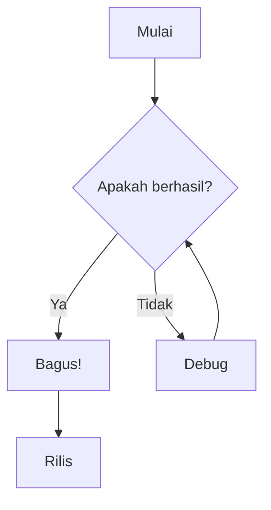
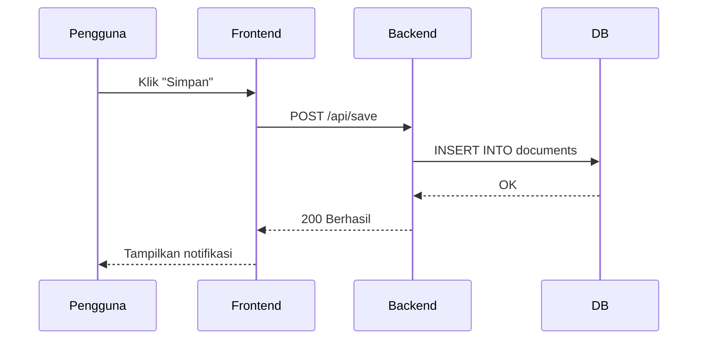
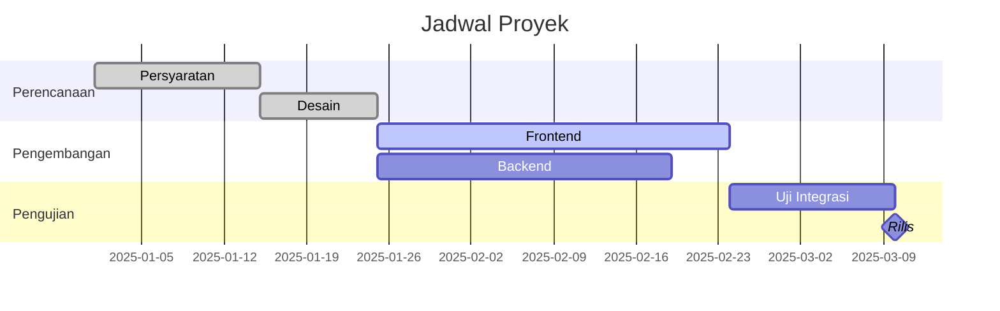
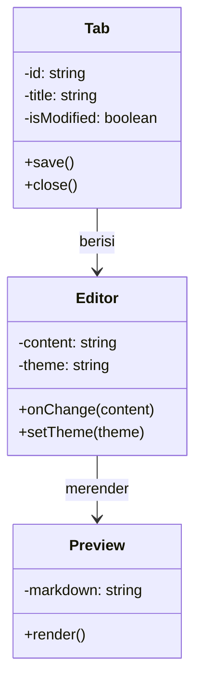
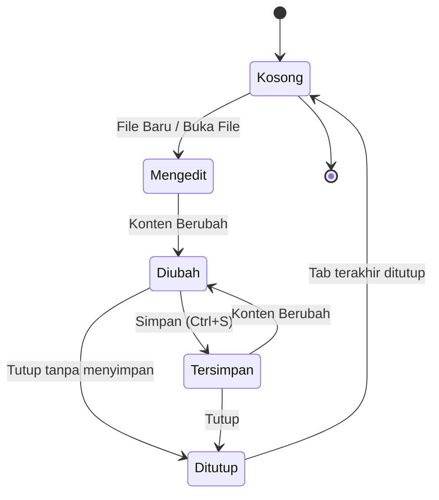
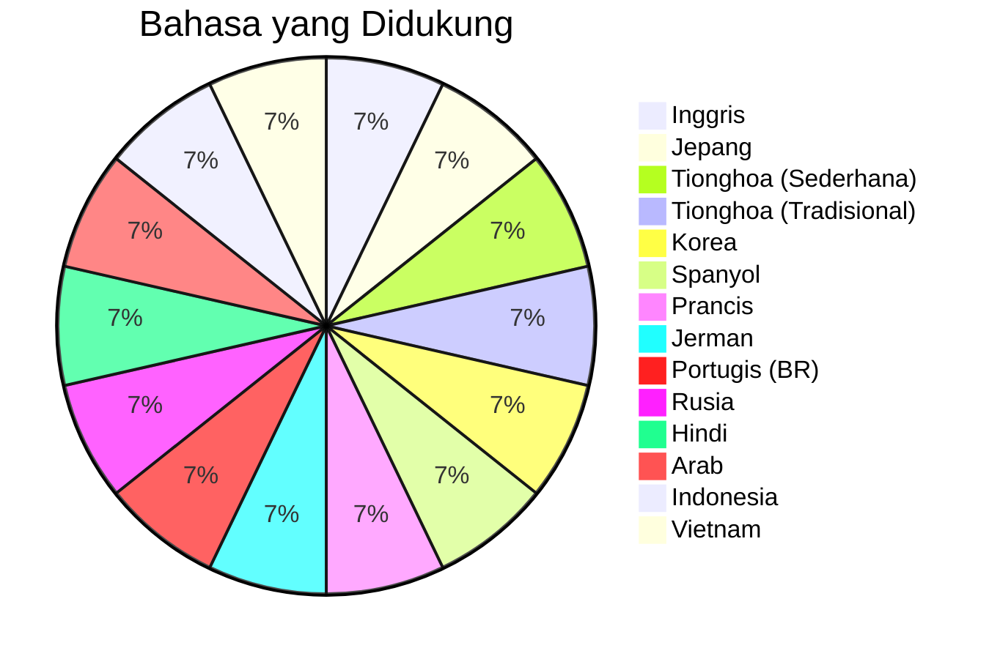

# Contoh Diagram Mermaid

Koleksi diagram Mermaid untuk memverifikasi rendering di Bokuchi.

## Diagram Alur



## Diagram Urutan



## Diagram Gantt



## Diagram Kelas



## Diagram Status



## Diagram Lingkaran



## Tes Penanganan Error

Blok berikut berisi kesalahan sintaks yang disengaja untuk memverifikasi tampilan error:

```mermaid
invalid diagram syntax !!!
this should show an error message
```
