<!-- _class: lead -->
<!-- _paginate: false -->
<!-- _header: '' -->
<!-- _footer: '' -->


# Bokuchi Editor

### オフラインで動く無料の Markdown エディター
### Windows・macOS・Linux 対応

---

## Bokuchi とは？

- 手元の PC で動く **Markdown エディター**
- **クラウド不要**、アカウント不要、トラッキングなし — ファイルはローカルに留まります
- 入力と同時に **リアルタイムプレビュー**
- **マルチプラットフォーム**: Windows · macOS · Linux
- **オープンソース**、無料で利用可能

> このスライドも Markdown で書かれており、Bokuchi の Marp 機能でレンダリングされています。

---

## Bokuchi を選ぶ理由

| | |
|---|---|
| **オフラインファースト** | ネット接続なしで動作 |
| **リアルタイムプレビュー** | 入力しながら結果を確認 |
| **マルチタブ編集** | 複数ファイルを同時に開き、セッションを自動復元 |
| **豊富な機能** | 変数、KaTeX、Mermaid、Marp など |
| **14 言語の UI** | English, 日本語, 中文, Español, हिन्दी, … |

---

## エディター & プレビューを並べて表示

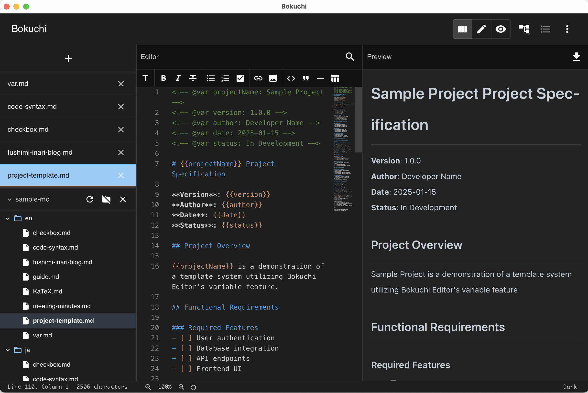

- **分割ビュー** — 左で編集、右でプレビュー
- **エディターのみ** / **プレビューのみ** モードも利用可能
- スクロールは **同期**
- `Ctrl+Shift+1/2/3` でいつでもモード切替

---

## UI の全体像

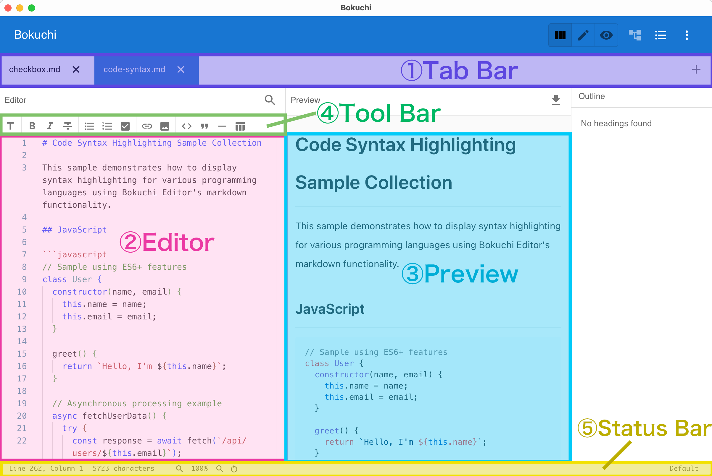

- 開いているファイルを示す **タブバー**
- ナビゲーション用の **フォルダツリー**
- 見出し一覧の **アウトライン** パネル
- ズームや文字数を示す **ステータスバー**
- 右側の **プレビュー** ペイン

---

## マルチタブ編集

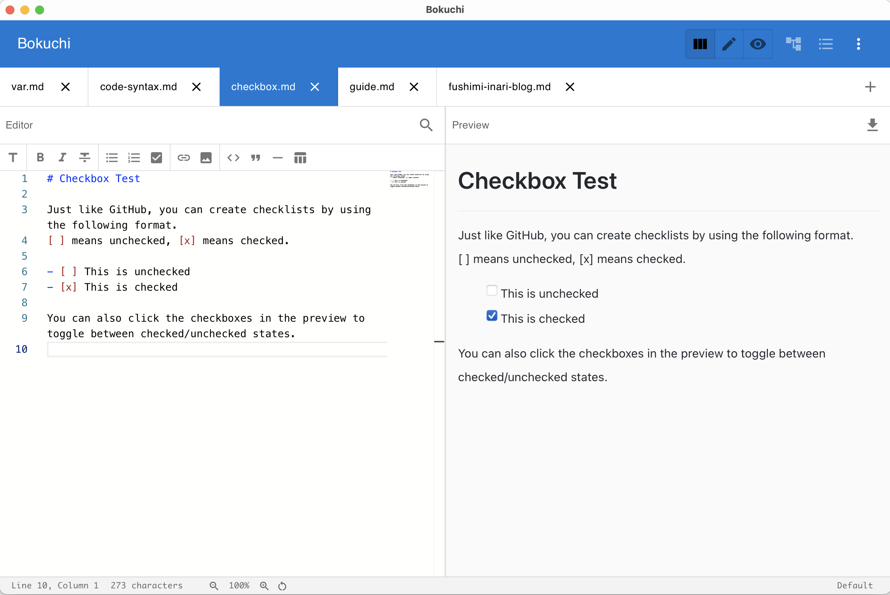

- **複数ファイル** を同時に開ける
- **ドラッグ & ドロップ** で並び替え
- **セッション復元** — 前回の続きから再開可能
- `Ctrl+Tab` / `Ctrl+Shift+Tab` で切替
- **横タブ / 縦タブ** の両方に対応

---

## フォルダツリー

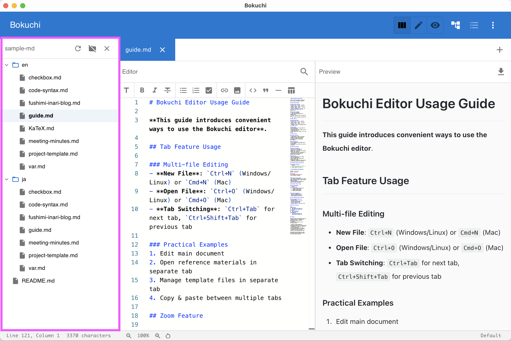

- 任意のフォルダを **ワークスペース** として参照
- ツリー上でファイルの作成・リネーム・削除
- **ドキュメントリポジトリ** やノート管理に最適
- エディターと常に同期

---

## アウトラインパネル

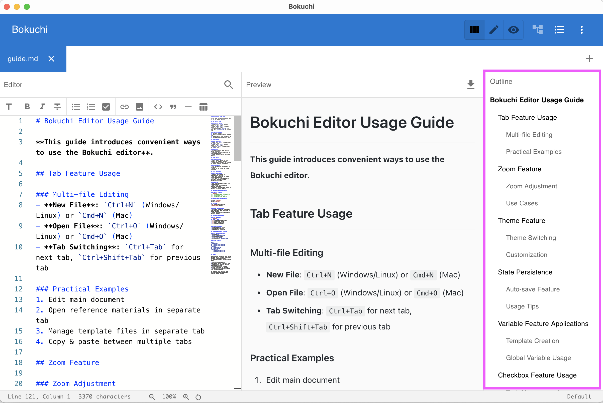

- 文書内のすべての **見出し** を一覧表示
- クリックで該当セクションに **ジャンプ**
- **長文ドキュメント**、仕様書、議事録で威力を発揮
- 編集と同時に自動更新

---

## Markdown ツールバー

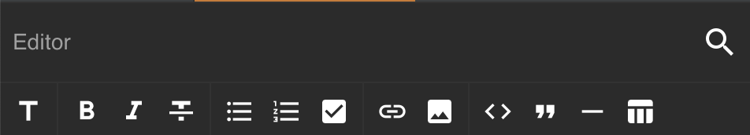

- **太字** / *斜体* / 見出し / リストをワンクリック
- **テーブル**、**コードブロック**、**リンク**、**画像** も対応
- TSV / CSV からの **テーブル変換**
- Markdown 記法を覚えていなくても使える

---

## 変数 — 再利用できるプレースホルダー

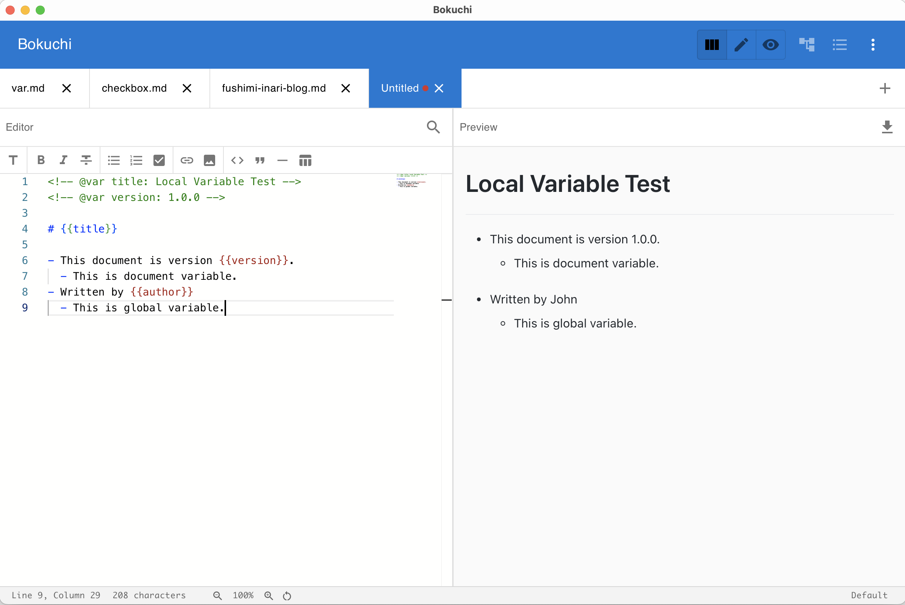

```markdown
<!-- @var projectName: Bokuchi -->
<!-- @var version: 1.0.0 -->

# {{projectName}} ドキュメント

バージョン: {{version}}
```

- **ローカル変数**: ドキュメント内で宣言
- **グローバル変数**: すべての文書で共有
- ローカルがグローバルに優先

---

## KaTeX — 美しい数式表示

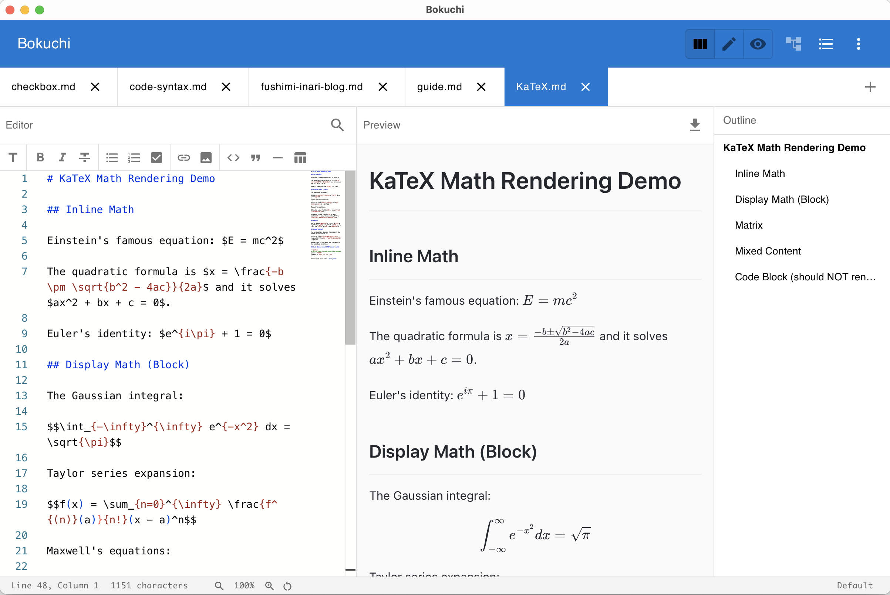

インライン: $E = mc^2$

ブロック:

$$
\int_{-\infty}^{\infty} e^{-x^2}\,dx = \sqrt{\pi}
$$

- **LaTeX** の数式を完全サポート
- プレビューに **即時反映**

---

## Mermaid — テキストから図を生成

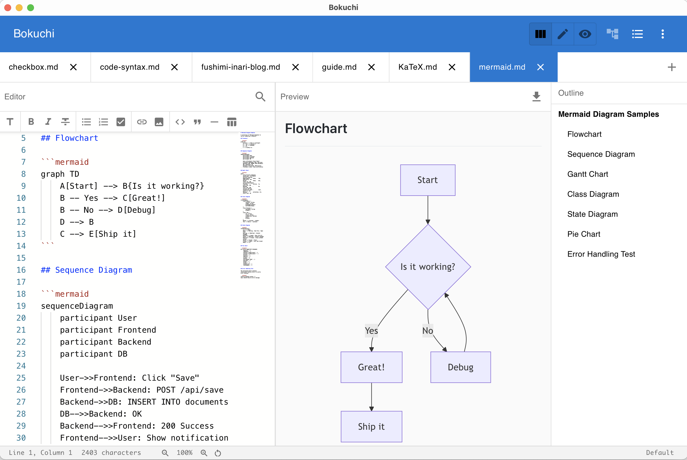

````markdown
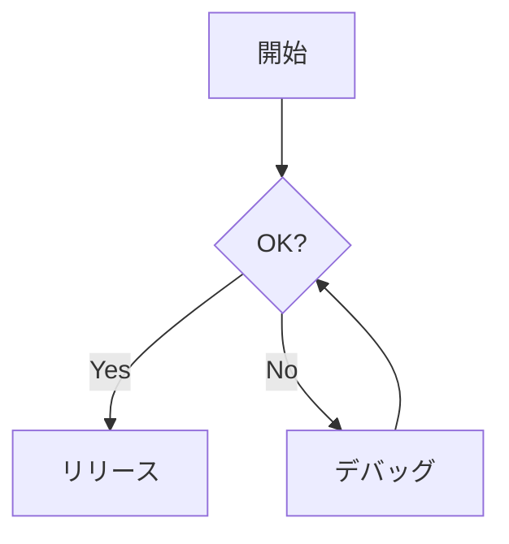
````

- **フローチャート**、**シーケンス図**、**クラス図**、**ガント** など多数
- 図をプレーンテキストで **バージョン管理** できる

---

## Marp — Markdown からスライドを生成

今ご覧いただいているものが、まさにそれです。

```markdown
---
marp: true
---

# スライド 1

こんにちは！

---

# スライド 2

- 項目 A
- 項目 B
```

- **設定 → 高度な設定 → レンダリング拡張** で有効化
- プレビューのみモードでは **矢印キー** でページ送り
- フルスクリーンとサムネイルグリッドに対応

---

## テーマ

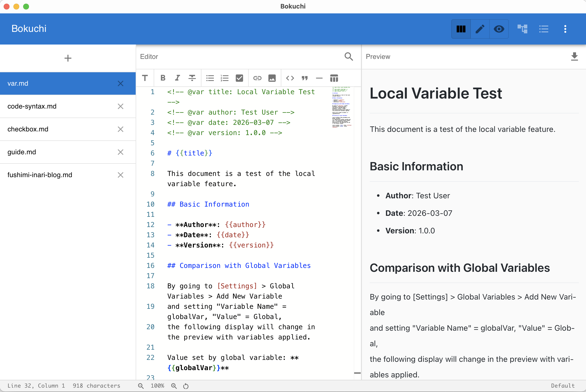
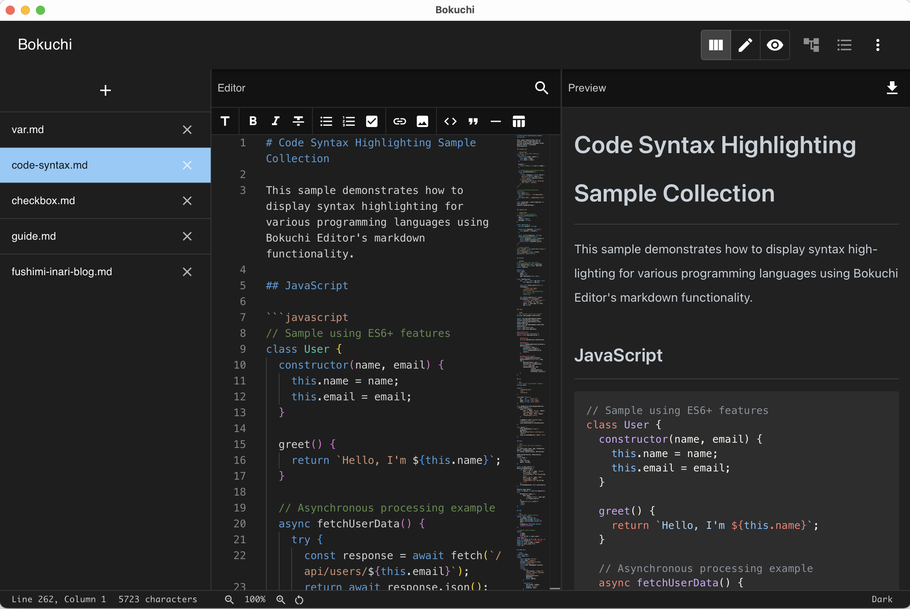

- **5 種類の組み込みテーマ** — Default、Dark、Darcula、Pastel、Vivid
- **エディター** と **プレビュー** で個別にテーマ設定可能
- カスタム **CSS** にも対応

---

## 検索 & 置換

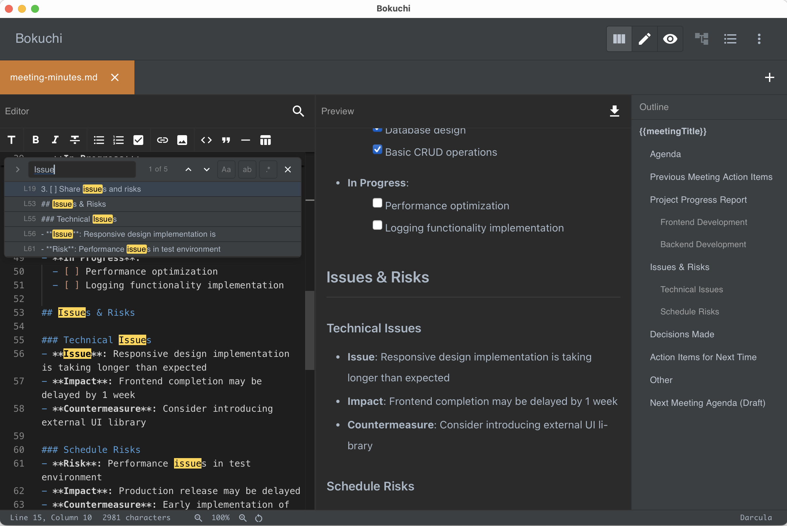

- 現在のファイル内を検索
- 開いているすべてのタブを対象にした **横断検索**
- **正規表現** と大文字小文字区別オプション
- 個別置換・一括置換のどちらにも対応

---

## キーボードショートカット（主要なもの）

| 操作 | Windows / Linux | macOS |
|--------|-----------------|-------|
| 新規ファイル | `Ctrl+N` | `Cmd+N` |
| ファイルを開く | `Ctrl+O` | `Cmd+O` |
| 保存 | `Ctrl+S` | `Cmd+S` |
| 次のタブ | `Ctrl+Tab` | `Ctrl+Tab` |
| ズームイン / アウト | `Ctrl++` / `Ctrl+-` | `Cmd++` / `Cmd+-` |
| 設定 | `Ctrl+,` | `Cmd+,` |

---

## Bokuchi を入手する

- **ウェブサイト**: https://bokuchi.com/
- **ダウンロード**: https://github.com/Bokuchi-Editor/bokuchi/releases
- **ドキュメント**: https://doc.bokuchi.com
- **ソース**: https://github.com/Bokuchi-Editor/bokuchi

無料・オープンソース。
アカウント不要、クラウド不要、トラッキングなし。

---

<!-- _class: lead -->
<!-- _paginate: false -->
<!-- _header: '' -->
<!-- _footer: '' -->

# ありがとうございました！

### Bokuchi で快適な執筆を ✍️


