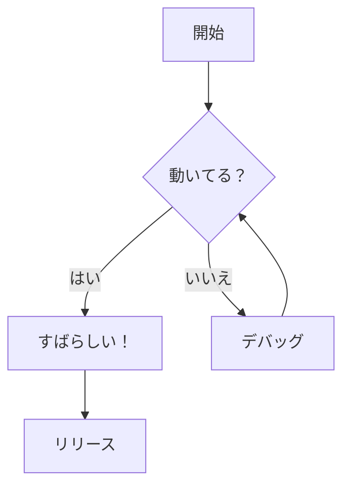
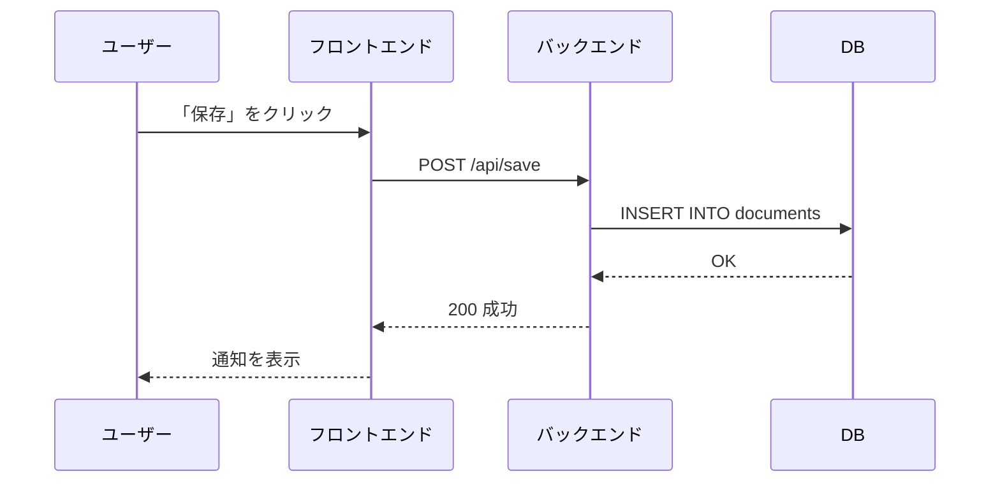
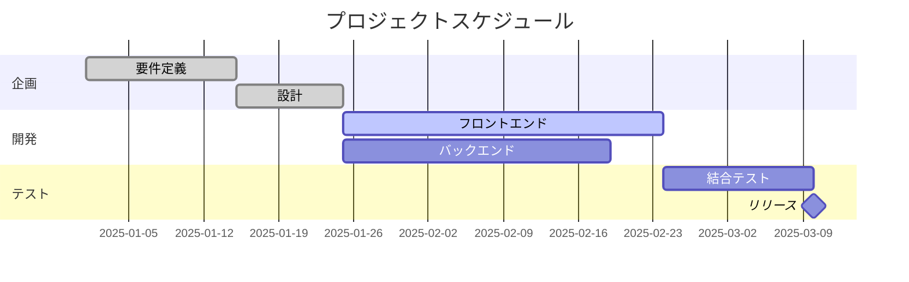
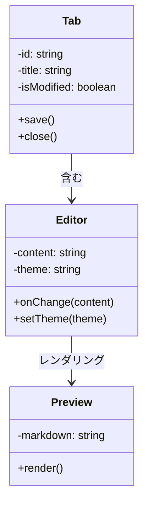
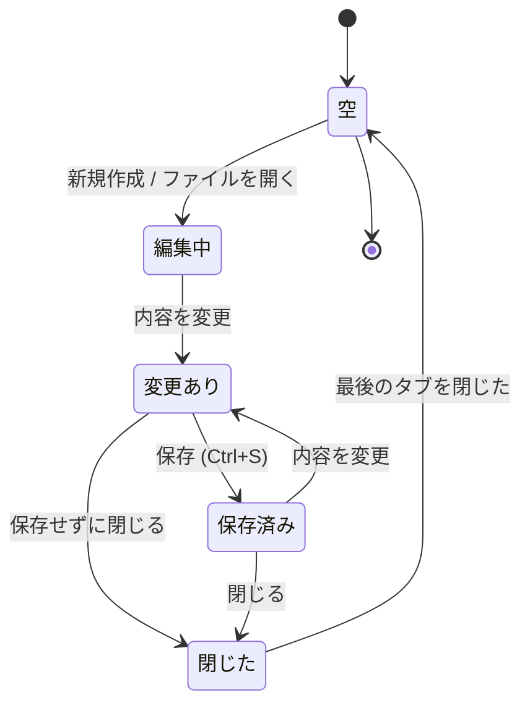
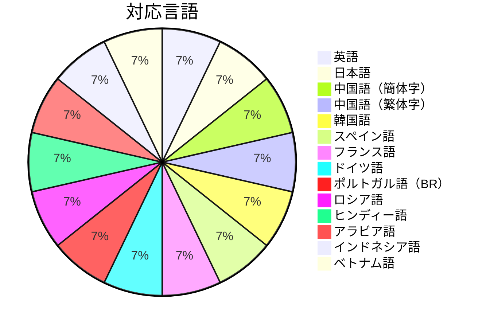

# Mermaid ダイアグラムサンプル

Bokuchi でのレンダリングを確認するための Mermaid ダイアグラム集です。

## フローチャート



## シーケンス図



## ガントチャート



## クラス図



## 状態遷移図



## 円グラフ



## エラーハンドリングテスト

以下のブロックにはエラー表示を確認するための不正な構文が含まれています:

```mermaid
invalid diagram syntax !!!
this should show an error message
```
