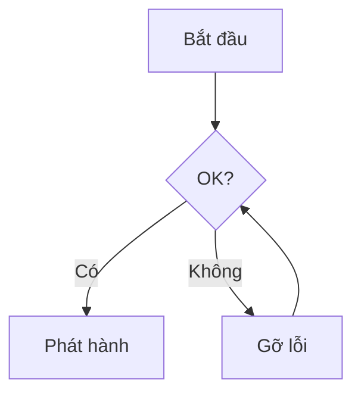

<!-- _class: lead -->
<!-- _paginate: false -->
<!-- _header: '' -->
<!-- _footer: '' -->


# Bokuchi Editor

### Trình soạn thảo Markdown offline miễn phí
### cho Windows, macOS, và Linux

---

## Bokuchi là gì?

- Một **trình soạn thảo Markdown** chạy hoàn toàn trên máy của bạn
- **Không cần cloud**, không cần tài khoản, không theo dõi — tệp của bạn ở máy cục bộ
- **Xem trước theo thời gian thực** khi bạn gõ
- **Đa nền tảng**: Windows · macOS · Linux
- **Mã nguồn mở** và miễn phí sử dụng

> Bộ slide này được viết bằng Markdown và render bằng tính năng Marp của Bokuchi.

---

## Tại sao chọn Bokuchi?

| | |
|---|---|
| **Ưu tiên offline** | Hoạt động không cần kết nối mạng |
| **Xem trước theo thời gian thực** | Thấy kết quả render ngay khi gõ |
| **Chỉnh sửa đa tab** | Mở nhiều tệp, tự động khôi phục phiên làm việc |
| **Tính năng phong phú** | Biến, KaTeX, Mermaid, Marp, và nhiều hơn |
| **14 ngôn ngữ giao diện** | English, 日本語, 中文, Español, हिन्दी, … |

---

## Trình soạn thảo & Xem trước song song


- **Chế độ chia đôi** — soạn bên trái, xem trước bên phải
- Các chế độ **chỉ soạn thảo** / **chỉ xem trước**
- Cuộn trang **đồng bộ**
- Đổi chế độ bất cứ lúc nào bằng `Ctrl+Shift+1/2/3`

---

## Tổng quan giao diện


- **Thanh tab** hiển thị các tệp đang mở
- **Cây thư mục** để điều hướng
- Bảng **outline** cho danh sách tiêu đề
- **Thanh trạng thái** với zoom & thống kê
- Khung **xem trước** ở bên phải

---

## Chỉnh sửa đa tab


- Mở **nhiều tệp** cùng lúc
- **Kéo & thả** để sắp xếp lại
- **Khôi phục phiên** — tiếp tục từ nơi bạn dừng lại
- `Ctrl+Tab` / `Ctrl+Shift+Tab` để chuyển tab
- Tab **ngang hoặc dọc**

---

## Cây thư mục


- Duyệt bất kỳ thư mục nào như một **không gian làm việc**
- Tạo, đổi tên, xóa tệp ngay tại chỗ
- Tuyệt vời cho **kho tài liệu** và hệ thống ghi chú
- Luôn đồng bộ với trình soạn thảo

---

## Bảng Outline


- Hiển thị tất cả **tiêu đề** trong tài liệu
- Bấm để **nhảy** đến một phần
- Thiết yếu cho **tài liệu dài**, đặc tả và biên bản
- Cập nhật trực tiếp khi bạn chỉnh sửa

---

## Thanh công cụ Markdown


- Một cú nhấp cho **in đậm**, *in nghiêng*, tiêu đề, danh sách
- **Bảng**, **khối mã**, **liên kết**, **hình ảnh**
- **Chuyển đổi bảng** từ TSV / CSV
- Không cần nhớ mọi ký hiệu Markdown

---

## Biến — Placeholder có thể tái sử dụng


```markdown
<!-- @var projectName: Bokuchi -->
<!-- @var version: 1.0.0 -->

# Tài liệu {{projectName}}

Phiên bản: {{version}}
```

- Biến **cục bộ**: khai báo trong tài liệu
- Biến **toàn cục**: chia sẻ cho mọi tài liệu
- Cục bộ được ưu tiên hơn toàn cục

---

## KaTeX — Công thức toán đẹp


Inline: $E = mc^2$

Khối:

$$
\int_{-\infty}^{\infty} e^{-x^2}\,dx = \sqrt{\pi}
$$

- Hỗ trợ đầy đủ phương trình **LaTeX**
- Render **tức thời** trên khung xem trước

---

## Mermaid — Sơ đồ từ văn bản


````markdown

````

- **Flowchart**, **sequence**, **class**, **gantt**, và nhiều hơn
- Sơ đồ vẫn nằm trong **version control** dưới dạng văn bản thuần

---

## Marp — Slide từ Markdown

Bạn đang xem một ví dụ ngay lúc này.

```markdown
---
marp: true
---

# Slide 1

Xin chào!

---

# Slide 2

- Điểm A
- Điểm B
```

- Bật trong **Cài đặt → Nâng cao → Rendering Extensions**
- Dùng **phím mũi tên** ở chế độ Chỉ xem trước
- Có sẵn chế độ toàn màn hình và lưới hình thu nhỏ

---

## Giao diện


- **5 giao diện tích hợp** — Default, Dark, Darcula, Pastel, Vivid
- Giao diện riêng cho **trình soạn thảo** và **xem trước**
- Hỗ trợ **CSS** tùy chỉnh

---

## Tìm kiếm & Thay thế


- Tìm trong tệp hiện tại
- **Tìm kiếm xuyên tab** trên tất cả tệp đang mở
- Tùy chọn **regex** và phân biệt hoa thường
- Thay thế từng kết quả, hoặc thay thế tất cả

---

## Phím tắt (một số phím cốt yếu)

| Hành động | Windows / Linux | macOS |
|--------|-----------------|-------|
| Tệp mới | `Ctrl+N` | `Cmd+N` |
| Mở tệp | `Ctrl+O` | `Cmd+O` |
| Lưu | `Ctrl+S` | `Cmd+S` |
| Tab kế tiếp | `Ctrl+Tab` | `Ctrl+Tab` |
| Phóng to / thu nhỏ | `Ctrl++` / `Ctrl+-` | `Cmd++` / `Cmd+-` |
| Cài đặt | `Ctrl+,` | `Cmd+,` |

---

## Nhận Bokuchi

- **Trang web**: https://bokuchi.com/
- **Tải xuống**: https://github.com/Bokuchi-Editor/bokuchi/releases
- **Tài liệu**: https://doc.bokuchi.com
- **Mã nguồn**: https://github.com/Bokuchi-Editor/bokuchi

Miễn phí và mã nguồn mở.
Không tài khoản. Không cloud. Không theo dõi.

---

<!-- _class: lead -->
<!-- _paginate: false -->
<!-- _header: '' -->
<!-- _footer: '' -->

# Cảm ơn bạn!

### Chúc bạn viết lách vui vẻ cùng Bokuchi ✍️


