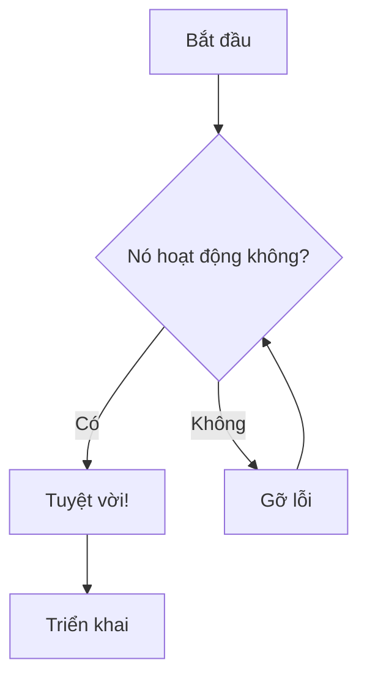
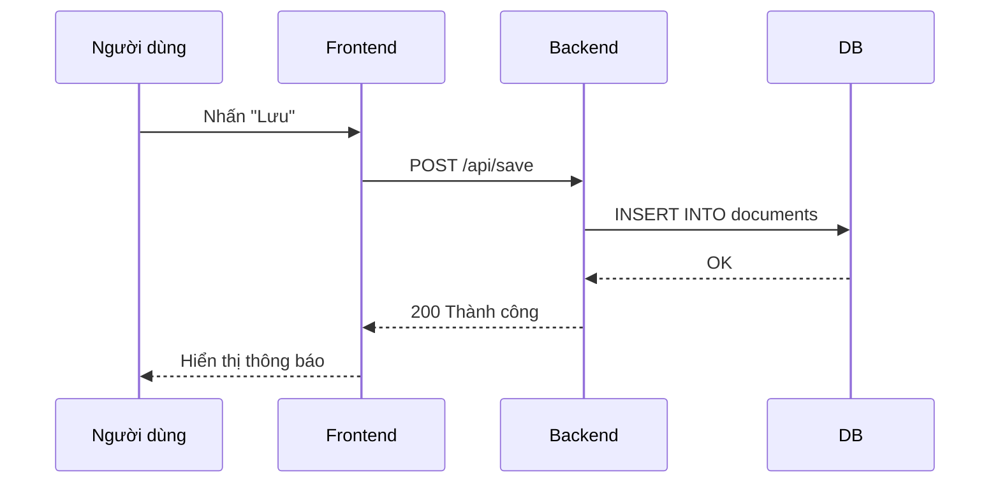
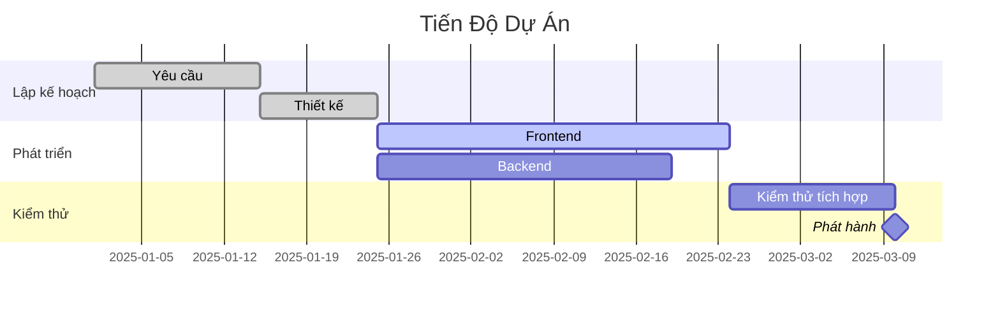
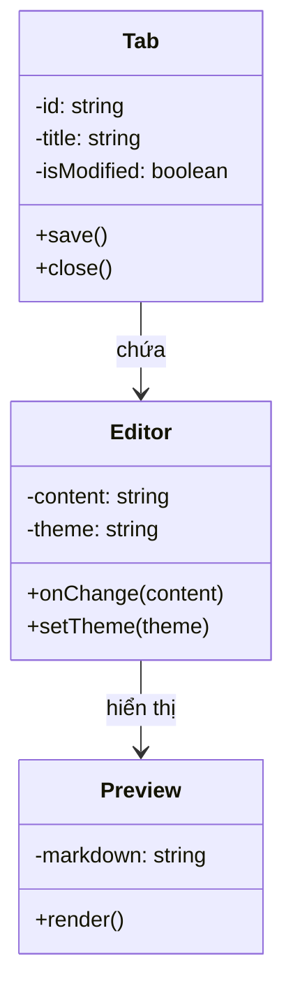
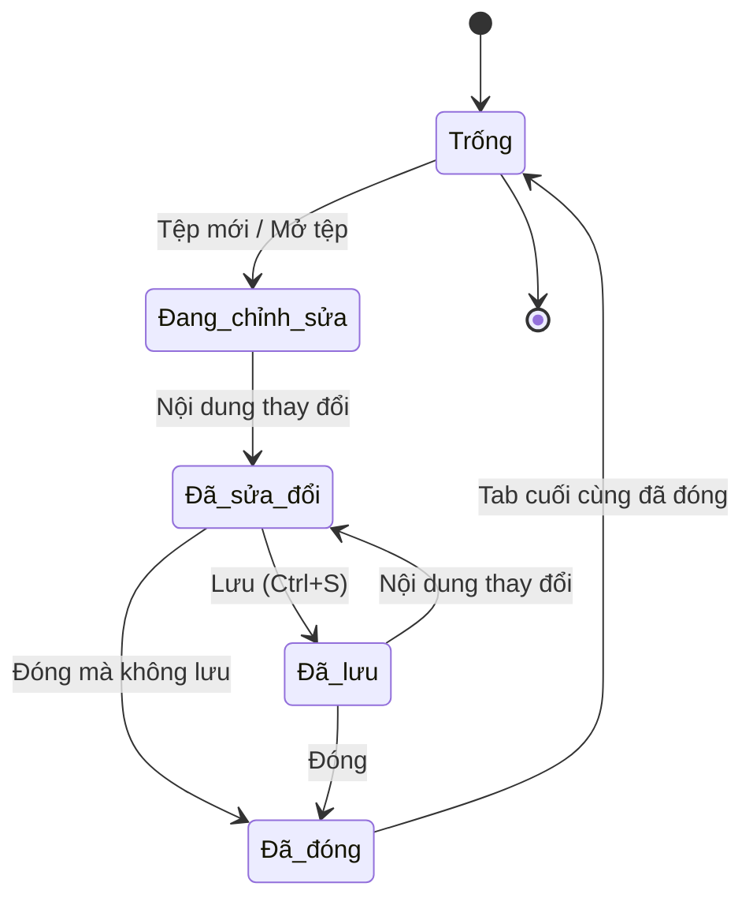
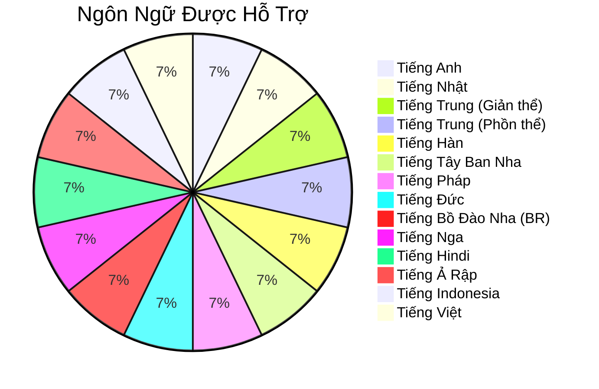

# Mẫu Biểu Đồ Mermaid

Bộ sưu tập các biểu đồ Mermaid để xác minh hiển thị trong Bokuchi.

## Lưu Đồ



## Biểu Đồ Trình Tự



## Biểu Đồ Gantt



## Biểu Đồ Lớp



## Biểu Đồ Trạng Thái



## Biểu Đồ Tròn



## Kiểm Tra Xử Lý Lỗi

Khối sau chứa lỗi cú pháp có chủ đích để xác minh hiển thị lỗi:

```mermaid
invalid diagram syntax !!!
this should show an error message
```
