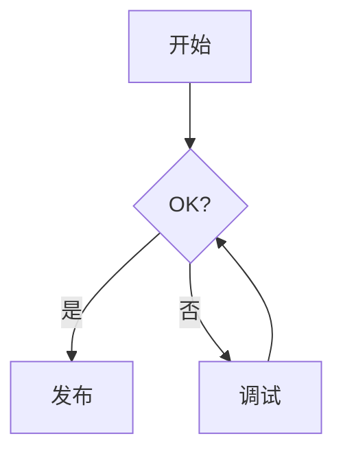

<!-- _class: lead -->
<!-- _paginate: false -->
<!-- _header: '' -->
<!-- _footer: '' -->


# Bokuchi Editor

### 免费的离线 Markdown 编辑器
### 支持 Windows、macOS 与 Linux

---

## Bokuchi 是什么？

- 一款完全在本机运行的 **Markdown 编辑器**
- **无需云端**、无需账户、不做任何追踪 — 文件始终留在本地
- 边输入边看的 **实时预览**
- **跨平台**：Windows · macOS · Linux
- **开源免费**

> 这份幻灯片本身就是用 Markdown 编写，由 Bokuchi 的 Marp 功能渲染而成。

---

## 为什么选择 Bokuchi？

| | |
|---|---|
| **离线优先** | 无需联网即可使用 |
| **实时预览** | 边输入边看渲染结果 |
| **多标签页编辑** | 同时打开多个文件，会话自动恢复 |
| **功能丰富** | 变量、KaTeX、Mermaid、Marp 等 |
| **14 种界面语言** | English, 日本語, 中文, Español, हिन्दी, … |

---

## 编辑器与预览并排显示


- **分屏视图** — 左边编辑，右边预览
- 支持 **仅编辑器** / **仅预览** 模式
- 滚动 **自动同步**
- 随时用 `Ctrl+Shift+1/2/3` 切换模式

---

## 界面概览


- 显示已打开文件的 **标签栏**
- 用于导航的 **文件夹树**
- 列出所有标题的 **大纲面板**
- 带缩放与统计信息的 **状态栏**
- 右侧的 **预览区**

---

## 多标签页编辑


- 同时打开 **多个文件**
- **拖拽** 即可重新排序
- **会话恢复** — 从上次停下的地方继续
- `Ctrl+Tab` / `Ctrl+Shift+Tab` 切换标签页
- 支持 **横向或纵向** 标签

---

## 文件夹树


- 将任意文件夹作为 **工作区** 浏览
- 直接在树上创建、重命名、删除文件
- 非常适合 **文档仓库** 与笔记系统
- 始终与编辑器保持同步

---

## 大纲面板


- 显示文档中的所有 **标题**
- 点击即可 **跳转** 到相应章节
- 对 **长文档**、规格说明、会议纪要非常实用
- 编辑时实时更新

---

## Markdown 工具栏


- 一键插入 **粗体**、*斜体*、标题、列表
- **表格**、**代码块**、**链接**、**图片**
- 可从 TSV / CSV **转换为表格**
- 无需记忆每一个 Markdown 符号

---

## 变量 — 可复用的占位符


```markdown
<!-- @var projectName: Bokuchi -->
<!-- @var version: 1.0.0 -->

# {{projectName}} 文档

版本：{{version}}
```

- **局部** 变量：在文档内声明
- **全局** 变量：在所有文档间共享
- 局部变量优先于全局变量

---

## KaTeX — 精美的数学公式


行内：$E = mc^2$

块级：

$$
\int_{-\infty}^{\infty} e^{-x^2}\,dx = \sqrt{\pi}
$$

- 完整支持 **LaTeX** 公式
- 在预览中 **即时** 渲染

---

## Mermaid — 用文本绘制图表


````markdown

````

- **流程图**、**时序图**、**类图**、**甘特图** 等多种图表
- 图表以纯文本形式纳入 **版本控制**

---

## Marp — 用 Markdown 做幻灯片

您现在看到的就是一份 Marp 幻灯片。

```markdown
---
marp: true
---

# 幻灯片 1

你好！

---

# 幻灯片 2

- 要点 A
- 要点 B
```

- 在 **设置 → 高级 → Rendering Extensions** 中启用
- 在仅预览模式下使用 **方向键** 翻页
- 内置全屏模式与缩略图网格

---

## 主题


- **5 款内置主题** — Default、Dark、Darcula、Pastel、Vivid
- **编辑器** 与 **预览** 可分别设置主题
- 支持自定义 **CSS**

---

## 查找与替换


- 在当前文件内查找
- 在所有已打开文件中进行 **跨标签页搜索**
- 支持 **正则表达式** 与区分大小写
- 可逐个替换或全部替换

---

## 键盘快捷键（主要几项）

| 操作 | Windows / Linux | macOS |
|--------|-----------------|-------|
| 新建文件 | `Ctrl+N` | `Cmd+N` |
| 打开文件 | `Ctrl+O` | `Cmd+O` |
| 保存 | `Ctrl+S` | `Cmd+S` |
| 下一个标签页 | `Ctrl+Tab` | `Ctrl+Tab` |
| 放大 / 缩小 | `Ctrl++` / `Ctrl+-` | `Cmd++` / `Cmd+-` |
| 设置 | `Ctrl+,` | `Cmd+,` |

---

## 获取 Bokuchi

- **官网**：https://bokuchi.com/
- **下载**：https://github.com/Bokuchi-Editor/bokuchi/releases
- **文档**：https://doc.bokuchi.com
- **源码**：https://github.com/Bokuchi-Editor/bokuchi

免费、开源。
无账户、无云端、无追踪。

---

<!-- _class: lead -->
<!-- _paginate: false -->
<!-- _header: '' -->
<!-- _footer: '' -->

# 感谢聆听！

### 使用 Bokuchi 愉快地书写 ✍️


