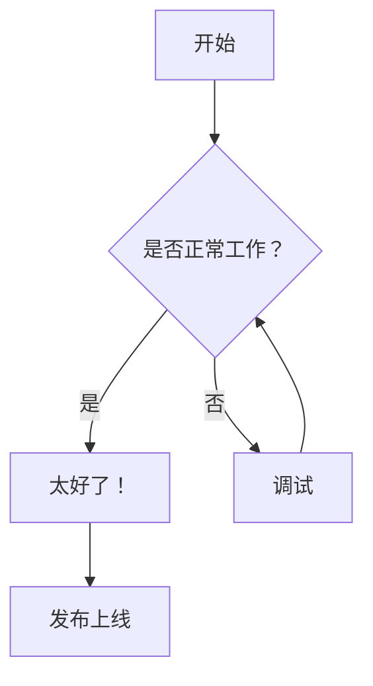
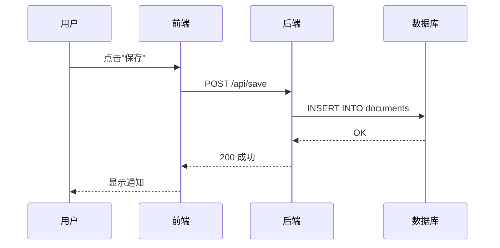
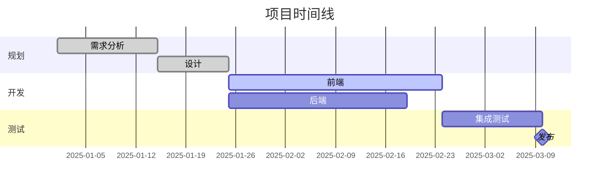
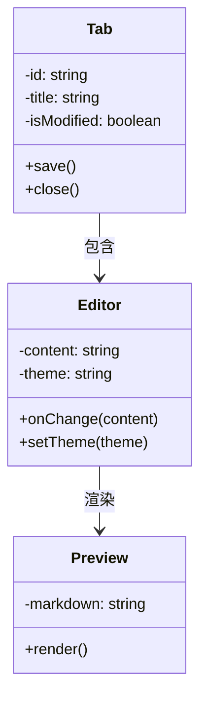
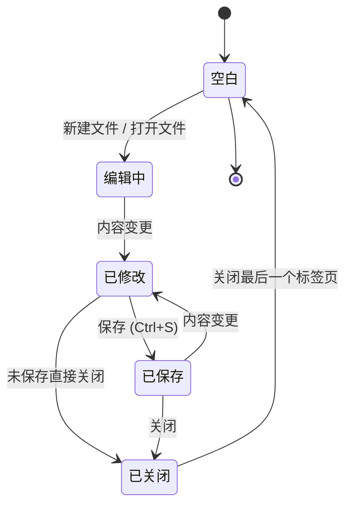
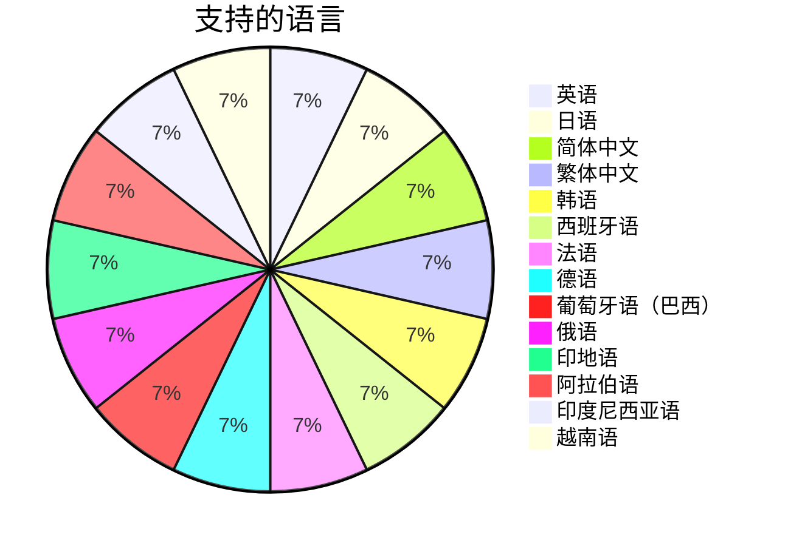

# Mermaid 图表示例

用于验证 Bokuchi 中 Mermaid 图表渲染效果的示例集合。

## 流程图



## 时序图



## 甘特图



## 类图



## 状态图



## 饼图



## 错误处理测试

以下代码块包含故意的语法错误，用于验证错误显示效果：

```mermaid
invalid diagram syntax !!!
this should show an error message
```
