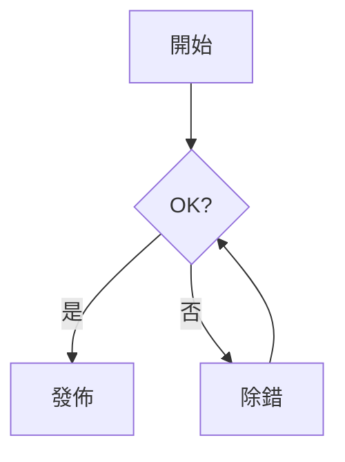

<!-- _class: lead -->
<!-- _paginate: false -->
<!-- _header: '' -->
<!-- _footer: '' -->


# Bokuchi Editor

### 免費的離線 Markdown 編輯器
### 支援 Windows、macOS 與 Linux

---

## 什麼是 Bokuchi？

- 一款完全在本機執行的 **Markdown 編輯器**
- **不需雲端**、不需帳號、不做任何追蹤 — 檔案始終留在本地
- 邊輸入邊看的 **即時預覽**
- **跨平台**：Windows · macOS · Linux
- **開源且免費**

> 這份投影片本身就是以 Markdown 撰寫，由 Bokuchi 的 Marp 功能渲染而成。

---

## 為什麼選擇 Bokuchi？

| | |
|---|---|
| **離線優先** | 無需網路連線即可使用 |
| **即時預覽** | 邊輸入邊看渲染結果 |
| **多分頁編輯** | 同時開啟多個檔案，自動還原工作階段 |
| **功能豐富** | 變數、KaTeX、Mermaid、Marp 等 |
| **14 種介面語言** | English, 日本語, 中文, Español, हिन्दी, … |

---

## 編輯器與預覽並排顯示


- **分割檢視** — 左側編輯，右側預覽
- 支援 **僅編輯器** / **僅預覽** 模式
- 捲動 **自動同步**
- 隨時以 `Ctrl+Shift+1/2/3` 切換模式

---

## 介面一覽


- 顯示已開啟檔案的 **分頁列**
- 用於導覽的 **資料夾樹**
- 列出所有標題的 **大綱面板**
- 顯示縮放與統計資訊的 **狀態列**
- 右側的 **預覽區**

---

## 多分頁編輯


- 同時開啟 **多個檔案**
- **拖放** 即可重新排序
- **工作階段還原** — 從上次停下的地方繼續
- `Ctrl+Tab` / `Ctrl+Shift+Tab` 切換分頁
- 支援 **水平或垂直** 分頁

---

## 資料夾樹


- 將任意資料夾當作 **工作區** 瀏覽
- 直接在樹狀結構上建立、重新命名、刪除檔案
- 非常適合 **文件儲存庫** 與筆記系統
- 始終與編輯器保持同步

---

## 大綱面板


- 顯示文件中所有 **標題**
- 點擊即可 **跳至** 相關章節
- 對 **長篇文件**、規格書、會議記錄非常實用
- 編輯時即時更新

---

## Markdown 工具列


- 一鍵插入 **粗體**、*斜體*、標題、清單
- **表格**、**程式碼區塊**、**連結**、**圖片**
- 可從 TSV / CSV **轉換為表格**
- 不需記住每一個 Markdown 符號

---

## 變數 — 可重複使用的佔位符


```markdown
<!-- @var projectName: Bokuchi -->
<!-- @var version: 1.0.0 -->

# {{projectName}} 文件

版本：{{version}}
```

- **區域** 變數：於文件內宣告
- **全域** 變數：於所有文件之間共用
- 區域變數優先於全域變數

---

## KaTeX — 精美的數學公式


行內：$E = mc^2$

區塊：

$$
\int_{-\infty}^{\infty} e^{-x^2}\,dx = \sqrt{\pi}
$$

- 完整支援 **LaTeX** 公式
- 於預覽中 **即時** 渲染

---

## Mermaid — 以文字繪製圖表


````markdown

````

- **流程圖**、**循序圖**、**類別圖**、**甘特圖** 等多種圖表
- 圖表以純文字形式納入 **版本控制**

---

## Marp — 以 Markdown 製作投影片

您現在看到的就是一份 Marp 投影片。

```markdown
---
marp: true
---

# 投影片 1

您好！

---

# 投影片 2

- 要點 A
- 要點 B
```

- 於 **設定 → 進階 → Rendering Extensions** 中啟用
- 在僅預覽模式下以 **方向鍵** 翻頁
- 內建全螢幕模式與縮圖網格

---

## 佈景主題


- **5 款內建佈景主題** — Default、Dark、Darcula、Pastel、Vivid
- **編輯器** 與 **預覽** 可分別設定佈景主題
- 支援自訂 **CSS**

---

## 搜尋與取代


- 於目前檔案內搜尋
- 於所有已開啟檔案中執行 **跨分頁搜尋**
- 支援 **正規表示式** 與區分大小寫
- 可逐一取代或全部取代

---

## 鍵盤快捷鍵（主要幾項）

| 操作 | Windows / Linux | macOS |
|--------|-----------------|-------|
| 新增檔案 | `Ctrl+N` | `Cmd+N` |
| 開啟檔案 | `Ctrl+O` | `Cmd+O` |
| 儲存 | `Ctrl+S` | `Cmd+S` |
| 下一個分頁 | `Ctrl+Tab` | `Ctrl+Tab` |
| 放大 / 縮小 | `Ctrl++` / `Ctrl+-` | `Cmd++` / `Cmd+-` |
| 設定 | `Ctrl+,` | `Cmd+,` |

---

## 取得 Bokuchi

- **官方網站**：https://bokuchi.com/
- **下載**：https://github.com/Bokuchi-Editor/bokuchi/releases
- **文件**：https://doc.bokuchi.com
- **原始碼**：https://github.com/Bokuchi-Editor/bokuchi

免費、開源。
無帳號、無雲端、無追蹤。

---

<!-- _class: lead -->
<!-- _paginate: false -->
<!-- _header: '' -->
<!-- _footer: '' -->

# 感謝聆聽！

### 使用 Bokuchi 愉快地書寫 ✍️


