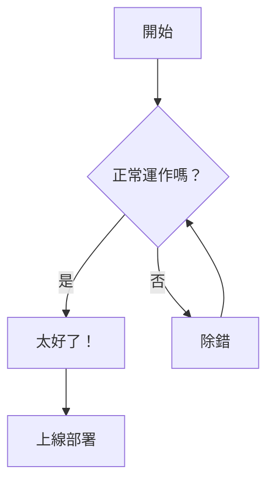
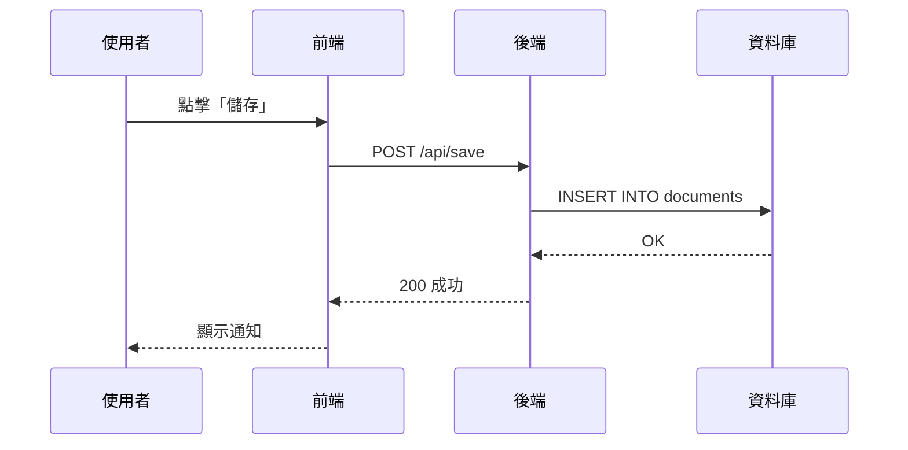
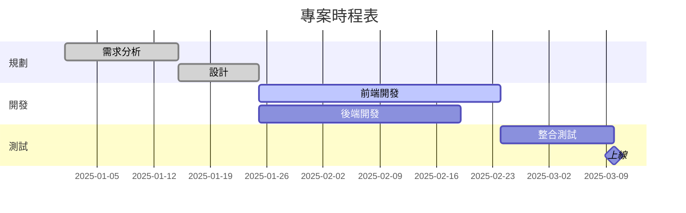
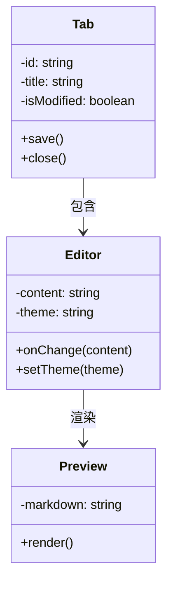
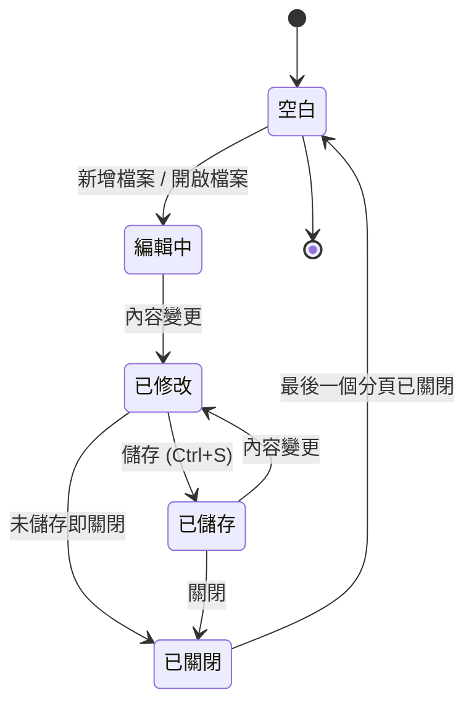
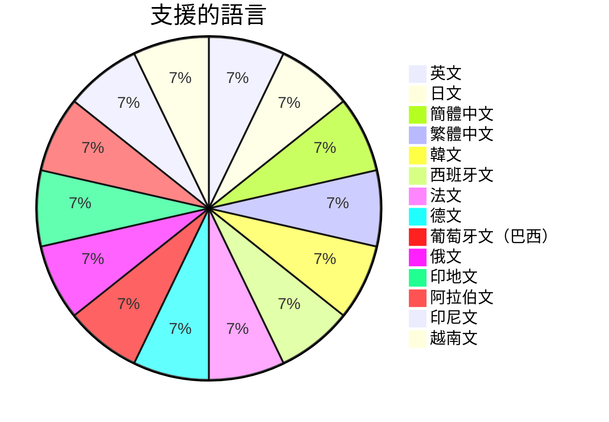

# Mermaid 圖表範例

用於驗證 Bokuchi 中 Mermaid 圖表渲染效果的範例集。

## 流程圖



## 時序圖



## 甘特圖



## 類別圖



## 狀態圖



## 圓餅圖



## 錯誤處理測試

以下區塊包含故意的語法錯誤，用於驗證錯誤訊息的顯示：

```mermaid
invalid diagram syntax !!!
this should show an error message
```
